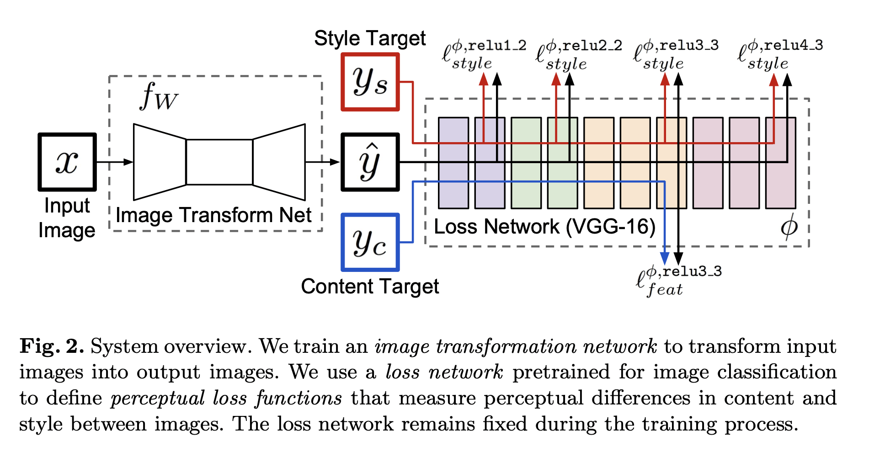

# DL Projekt: Style Transfer

### Exercise

Build a model, that takes a style image and mixes it with a content image. Demonstrate your results by creating a simple application, which takes a webcam frame and stylises it.

Paper: [https://cs.stanford.edu/people/jcjohns/papers/eccv16/JohnsonECCV16.pdf](https://cs.stanford.edu/people/jcjohns/papers/eccv16/JohnsonECCV16.pdf)

Dataset for content images: [http://cocodataset.org/#download](http://cocodataset.org/#download)

### Paper — Perceptual Losses for Real-Time Style Transfer and Super-Resolution — summary

### Image Transformation Problem: How to determine the loss of the output image (given the label image)

1. ************Train Feed-Forward CNN and determine loss on per pixel basis************
    
    ****************Used for: super-resolution, colorization, segmentation, depth and surface normal prediction,**************** 
    
    Pros:
    
    - efficient inference / test time → only single forward pass
    
    Cons:
    
    - does not capture any **perceptual** differences (e.g. features → if output is label moved by 1 Pixel high loss but actually good result)

1. **********Determine loss with *perceptual loss functions*** 
    
    Determine loss via differences between high-level image feature representations extracted from pretrained convolutional neural networks.
    
    Images are then generated by minimizing the loss function (what parameters are tweaked in order to minimize the loss function?) 
    
    ********************Used for: feature inversion, feature visualization, texture synthesis and style transfer********************
    
    → Inverse Pros/Cons of Previous
    
2. **Train feed-forward transformation networks for image transformation tasks and use a perceptual loss function at training**
    
    During training, perceptual losses mea- sure image similarities more robustly than per-pixel losses, and at test-time the transformation networks run in real-time
    
    ********Used For: style transfer and single-image super-resolution********
    

**Problem an style transfer and single-image super-resolution:**

→ beide haben große Menge an möglichen und auch korrekten Ausgaben → Bewertung erfordert **************semantic reasoning************** auf input-image

### Proposed System:

### Methodik:

*****************************Image Transformation Network***************************** $f_W$ — hierfür wird ein Deep RCNN benutzt um die jeweiligen Output Images $\hat{y} =f_W(x)$ aus den Eingabebilder zu erstellen

L******oss Network****** defines ******loss-functions $\ell_i(\hat{y}, y)$ (scalars)*

************Train —************ The image transformation network is trained using stochastic gradient descent to minimize a weighted combination of loss functions

Idee — CNN’s trained for Classification already have an idea of semantic / perceptual information → use a pretrained CNN $**\phi**$ to define two different loss-functions:

***feature reconstruction loss $\ell_{\text{feat}}^\phi$*

********style transfer loss $\ell_{\text{style}}^{\phi}$*

Für jedes input image ist gegeben:

********content target $y_c$*

********style target $y_s$*

************Konkret bei Style Transfer************

Bei Style Transfer gilt: $y_c = x$ und $\hat{y}$ ist Kombi von $y_c$ und $y_s$ (****************wichtig: wir trainieren ein Network pro Style target****************)

******Bei Super-Resolution:******

input x is a low-resolution input, the content target y_c is the ground-truth high-resolution image, and style reconstruction loss is not used; we train one network per super-resolution factor.

## Image Transformation Network:

- Follow: Unsupervised representation learning with deep convolutional generative adversarial networks. In: ICLR. (2016)
[https://arxiv.org/pdf/1511.06434.pdf](https://arxiv.org/pdf/1511.06434.pdf)
- No Pooling Layers instead use strided and fractionally strided Convolutions
- Network Body consists of five residual blocks
[https://arxiv.org/pdf/1512.03385.pdf](https://arxiv.org/pdf/1512.03385.pdf)
- Use architecture of following:
[http://torch.ch/blog/2016/02/04/resnets.html](http://torch.ch/blog/2016/02/04/resnets.html)
- all non-residual convolutional layers are followed by batch normalization and ReLU nonlinearities (except the outputlayer which uses a scaled tanh → range 0,255)
- first and last conv-layers use 9x9 kernels, the rest 3x3
- for style transfer in- and out- shapes are 3×256×256 and for super-resolution
- for style transfer stride = 2  und danach stride=1/2 hat vorteile, dass:
    - down-/up sampling → quadratische laufzeit benefits
- warum residual connections? → sollen es erleichtern die Identity-Function zu erlernen, appealing, weil meist bei style transfer gleiche Struktur geshared werden soll

### Perceptual Loss Functions:

- the loss network φ is the 16-layer VGG network [51] pretrained on ImageNet
    
    ********************************************************Feature Reconstruction Loss:********************************************************
    
    Let φj(x) be the activations of the jth layer of the network φ when processing the image x; if j is a convolutional layer then φj(x) will be a feature map of shape Cj × Hj × Wj. The feature reconstruction loss is the (squared, normalized) Euclidean distance between feature representations:
    
    
    
    Hier wird dann der Loss einfach über den loss aller Layers aufsummiert.
    
    ************Style************ 
    
    Idee wie oben, nur dass hier aus $\phi_j$ (mit Shape $\mathbb{R}^{C_j \times N_j \times H_j}$) ne Gram Matrix (warum nicht eventl. einfach Kernelmatrix mit cooler Kernel-Method?)
    
    
    
    Kann hier auch effizienter mit Vecotrization berechent werden durch folgendes (wobei $\psi$ alle einzelnen $\phi$ Zeilenweise gestackt ist)
    
    
    
    Then the *********************************Style Reconstruction Loss********************************* is just Frobenius Norm of:
    
    
    
    ### Experiments:
    
    ******************Baseline:******************
    
    Try to optimize y: ($y_c$ is Feature Label and $y_s$ is style label)
    
    
    
    Optimization via L-BFGS?, converges within 500 Iterations → slow because forward and backward pass (very helpful to clip output to a range of (0, 255) because it often occurs that the output image exceeds these bounds)
    
    ******************Actual Method:******************
    
    Training on ********MS-Coco******** dataset resize to 256x256, batchsize 4, for 40k iterations ($\approx 2$ Epochs). Adam with lr 1x10^-3
    
    The output images are regular- ized with total variation regularization with a strength of between 1 × 10−6 and 1×10−4, chosen via cross-validation per style target ???????
    
    For all style transfer experiments we compute feature reconstruction loss at layer relu3_3 and style reconstruction loss at layers relu1_2, relu2_2, relu3_3, and relu4_3 of the VGG-16 loss network φ.
    

### Supplementary Material:

[here](https://cs.stanford.edu/people/jcjohns/papers/fast-style/fast-style-supp.pdf)